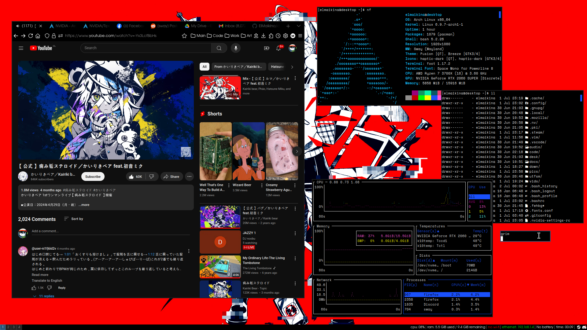

# Overview
Dotfiles optimizados para mi flujo de trabajo. El enfoque es el uso de un Tiling Window Manager y
de Terminal, a veces incluso usando la _tty_ pura. Esta metodologia permite trabajar usando casi
puramente el teclado. Tambien hay algunas optimizaciones para _nvidia_, _steam_, _wayland_ y aceleracion
por GPU.

# Herramientas
Herramientas que uso para agilizar mi trabajo, las elegi ya que en su mayoria son sencillas, rapidas
y Open Source, por ende tienen amplio soporte y documentacion.

De momento intento integrar todo usando _wayland_ y _pipewire_ como Back-Ends. En terminos de _shell_, aun
utilizo _bash_, aunque prontamente intentare probar _zsh_.

## Graficas
Se usan en ambientes graficos

- firefox: navegador web
- dwl: gestor de ventanas
- wezterm: terminal
- imv: visualizador de imagenes
- mpv: reproductor de videos
- zathura: lector de pdf's

## Terminal
Se usan desde el terminal

- tmux: multiplexor de terminales
- nvchad: editor de texto
- taskranger: gestor de tareas
- bottom: gestor de procesos
- wf-recorder: grabar pantalla
- aria2c: descargar torrents
- ????: gestionar pantallas
- ????: reproducir musica
- ????: gestionar audio

# Variables de Entorno
El archivo _enviroment_ contiene algunas variables destinadas a dar alto rendimiento y compatibilidad
con _wayland_, haciendo uso de aceleracion por hardware. Otras variables tambien ofrecen optimizaciones
para tarjetas graficas _nvidia_.

# Fuentes
Las fuentes las elegi porque son bonitas y porque se distinguen en DPIs bajos, lo cual brinda mejor
uso del espacio independiente de la resolucion de la pantalla. Sumado a esto, hay un archivo _fonts.conf_ que mejora el renderizado de todas las fuentes del sistema, ayudando la legibilidad y estetica.

# Firefox CSS
Previamente usaba mi propio CSS para firefox, ahora mismo estoy usando basado en este: https://github.com/Dook97/firefox-qutebrowser-userchrome/tree/master por temas de minimalismo y eficiencia.

# Screenshot
Foto de como se ve el ambiente completo en accion.

