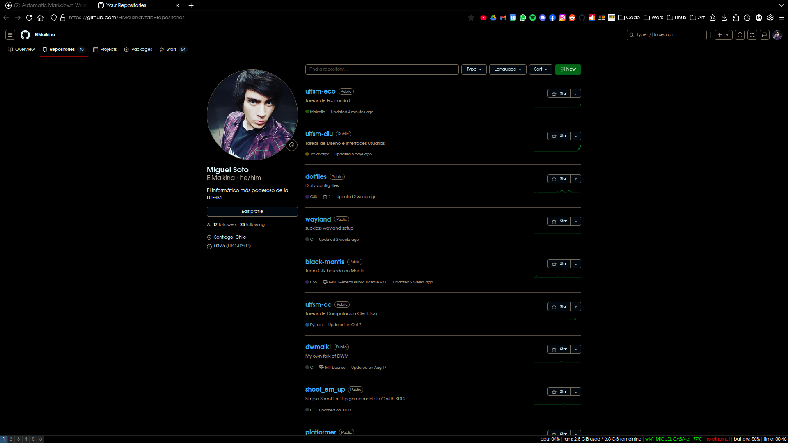
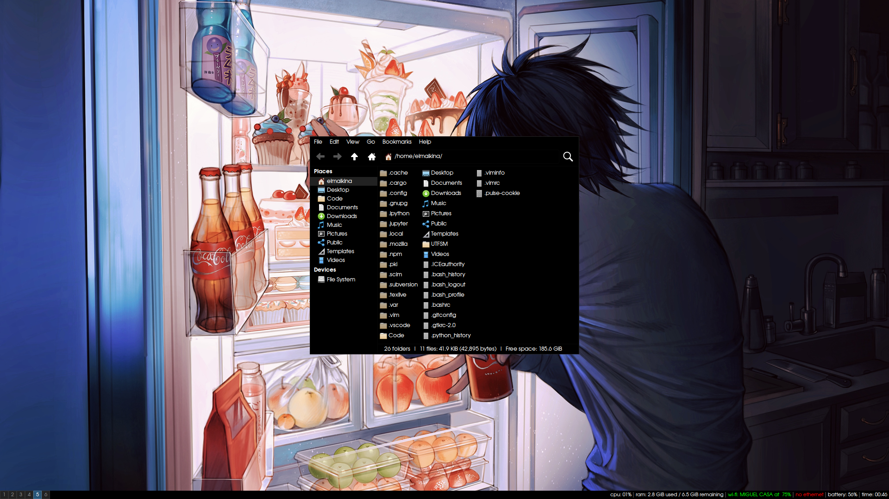
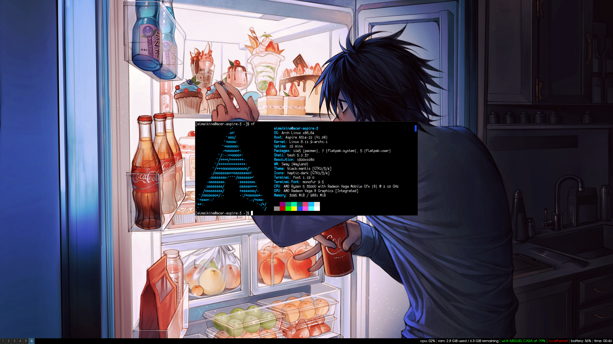

# Overview
Dotfiles optimizados para mi flujo de trabajo. El enfoque es el uso de un Tiling Window Manager y
de Terminal, a veces incluso usando la _tty_ pura. Esta metodologia permite trabajar usando casi
puramente el teclado. Tambien hay algunas optimizaciones para _nvidia_, _steam_, _wayland_ y aceleracion por GPU.

# Herramientas
Herramientas que uso para agilizar mi trabajo, las elegi ya que en su mayoria son sencillas, rapidas
y Open Source, por ende tienen amplio soporte y documentacion.

## Graficas
Se usan en ambientes graficos

- firefox: navegador web
- sway: gestor de ventanas
- foot: terminal
- sway-img: visualizador de imagenes
- mpv: reproductor de videos
- zathura: lector de pdf's
- vscode: editor de texto y IDE

## Terminal
Se usan desde el terminal

- vim: editor de texto
- tmux: multiplexor de terminales
- taskranger: gestor de tareas
- wf-recorder: grabar pantalla

# Variables de Entorno
El archivo _enviroment_ contiene algunas variables destinadas a dar alto rendimiento y compatibilidad
con _wayland_, haciendo uso de aceleracion por hardware. Otras variables tambien ofrecen optimizaciones
para tarjetas graficas _nvidia_.

# Fuentes
Las fuentes las elegi porque son bonitas y porque se distinguen en DPIs bajos, lo cual brinda mejor
uso del espacio independiente de la resolucion de la pantalla. Sumado a esto, hay un archivo _fonts.conf_ 
que mejora el renderizado de todas las fuentes del sistema, ayudando la legibilidad y estetica.

# Firefox CSS
Previamente usaba mi propio CSS para firefox, ahora mismo estoy usando basado en este: 
https://github.com/Dook97/firefox-qutebrowser-userchrome/tree/master por temas de minimalismo 
y eficiencia.

# Como instalar paquetes
Para instalar los paquetes en _pkglist.txt_ hay que ejecutar el siguiente comando:

```
pacman -S --needed - < pkglist.txt
```

_(Sacado directo de la ArchWiki)_

# Screenshots





